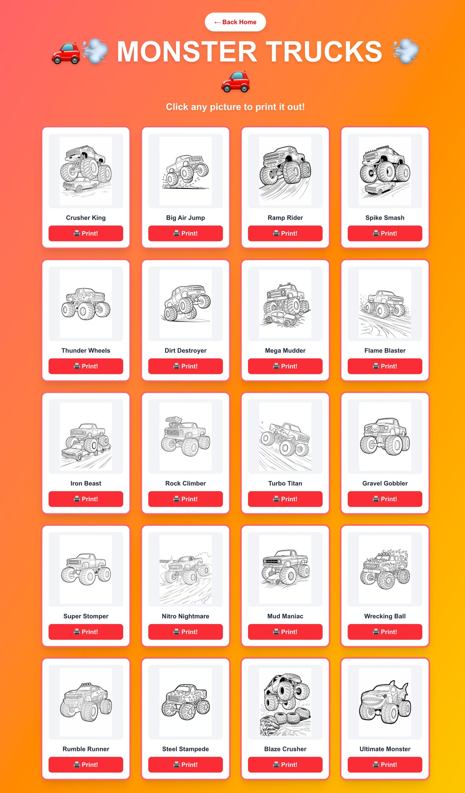

# 🎨 Lucian & Gideon's Coloring Fun!

A kids' coloring page web app built for Lucian and Gideon. Browse 91 print-ready coloring pages across four fun categories — Monster Trucks, Dinosaurs, Robots, and Superheroes. Just tap a picture, hit print, and start coloring!

🌐 **Live site:** [lucianandgideon.com](https://lucianandgideon.com)

---

## Screenshots

### Home Screen


### Gallery Page (Monster Trucks)


---

## Features

- 🖨️ **Print-ready pages** — high-quality coloring pages extracted from PDF source files at 150 DPI
- 📱 **Installable PWA** — add to home screen on iPhone, iPad, or Android for an app-like experience
- ⚡ **Offline support** — service worker caches pages so it works without Wi-Fi once loaded
- 🎨 **4 categories, 91 pages total:**
  - 🚗💨 **Monster Trucks** — 20 pages (Hot Wheels, big trucks, mud mashers)
  - 🦖🦕 **Dinosaurs** — 25 pages (T-Rex, Triceratops, and friends)
  - 🤖⚡ **Robots** — 15 pages (cool robots and machines)
  - 🦸‍♂️⚡ **Superheroes** — 31 pages (Batman, Superman, and more)
- 🖼️ **Fast thumbnail previews** — small thumbnails load instantly; full-size image opens for printing
- 🏠 **Kid-friendly UI** — big buttons, bright colors, easy navigation

---

## How to Use

1. Go to [lucianandgideon.com](https://lucianandgideon.com)
2. Pick a category (Monster Trucks, Dinosaurs, Robots, Superheroes)
3. Tap any coloring page to open it full size
4. Hit the **🖨️ Print!** button or use your browser's print function
5. Color it in! 🖍️

### Install on iPhone/iPad

1. Open [lucianandgideon.com](https://lucianandgideon.com) in Safari
2. Tap the **Share** button (box with arrow)
3. Tap **Add to Home Screen**
4. Tap **Add** — it'll appear as an app icon!

---

## Tech Stack

| Layer | Tech |
|---|---|
| Framework | [Next.js](https://nextjs.org) 15 (App Router, TypeScript) |
| Styling | [Tailwind CSS](https://tailwindcss.com) |
| PWA | Web App Manifest + Service Worker (manual, no next-pwa) |
| Hosting | [AWS Amplify](https://aws.amazon.com/amplify/) (auto-deploy on push to `main`) |
| DNS | [Cloudflare](https://cloudflare.com) (grey-cloud / DNS-only) |
| Images | PNG extracted from PDF sources via `pdfimages` at 150 DPI |
| Thumbnails | 600px max via `sips` (macOS) |

---

## Development

```bash
# Install dependencies
npm install

# Run dev server
npm run dev
```

Open [http://localhost:3000](http://localhost:3000) in your browser.

### Project Structure

```
app/
├── page.tsx              # Home screen (category cards)
├── monster-trucks/       # Monster Trucks gallery
├── dinosaurs/            # Dinosaurs gallery
├── robots/               # Robots gallery
└── superheroes/          # Superheroes gallery

components/
├── ColoringGallery.tsx   # Shared gallery component
└── ServiceWorkerRegister.tsx

public/
├── coloring-pages/
│   ├── monster-trucks/   # 20 PNGs + thumbs/
│   ├── dinosaurs/        # 25 PNGs + thumbs/
│   ├── robots/           # 15 PNGs + thumbs/
│   └── superheroes/      # 31 PNGs + thumbs/
├── manifest.webmanifest  # PWA manifest
├── sw.js                 # Service worker
└── icons/                # App icons (11 sizes)
```

### Deploy

Pushing to `main` automatically triggers a build and deploy on AWS Amplify.

```bash
git add .
git commit -m "your changes"
git push origin main
```

---

## Live URLs

- **Primary:** https://lucianandgideon.com
- **www:** https://www.lucianandgideon.com
- **Amplify:** https://main.d8trutozhfvsx.amplifyapp.com

---

Made with ❤️ for Lucian and Gideon
